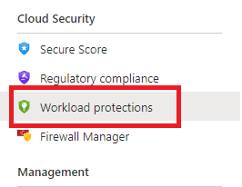
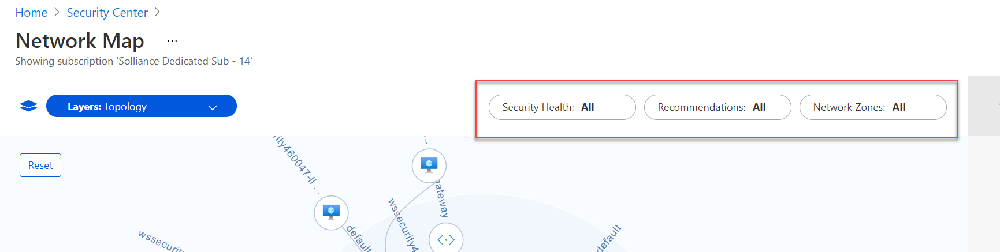
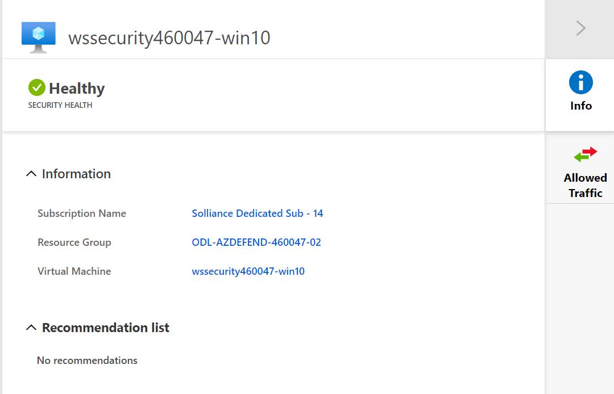
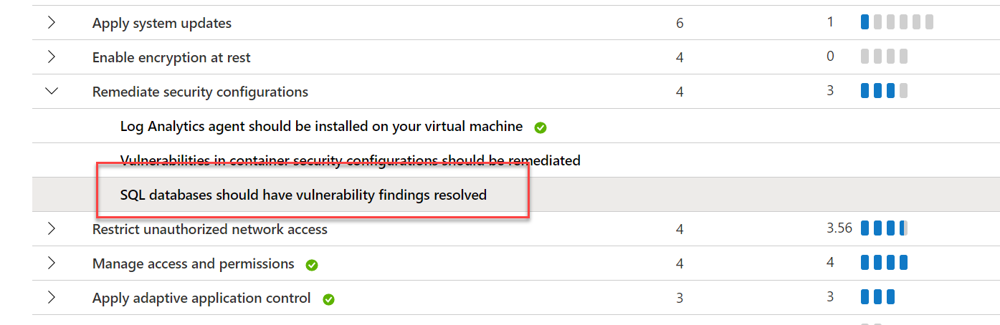
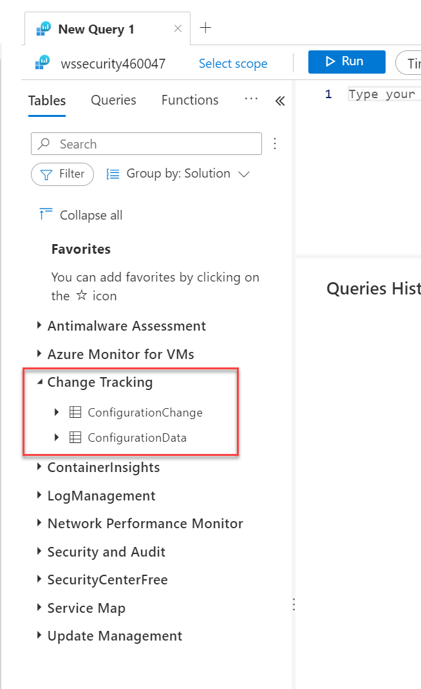
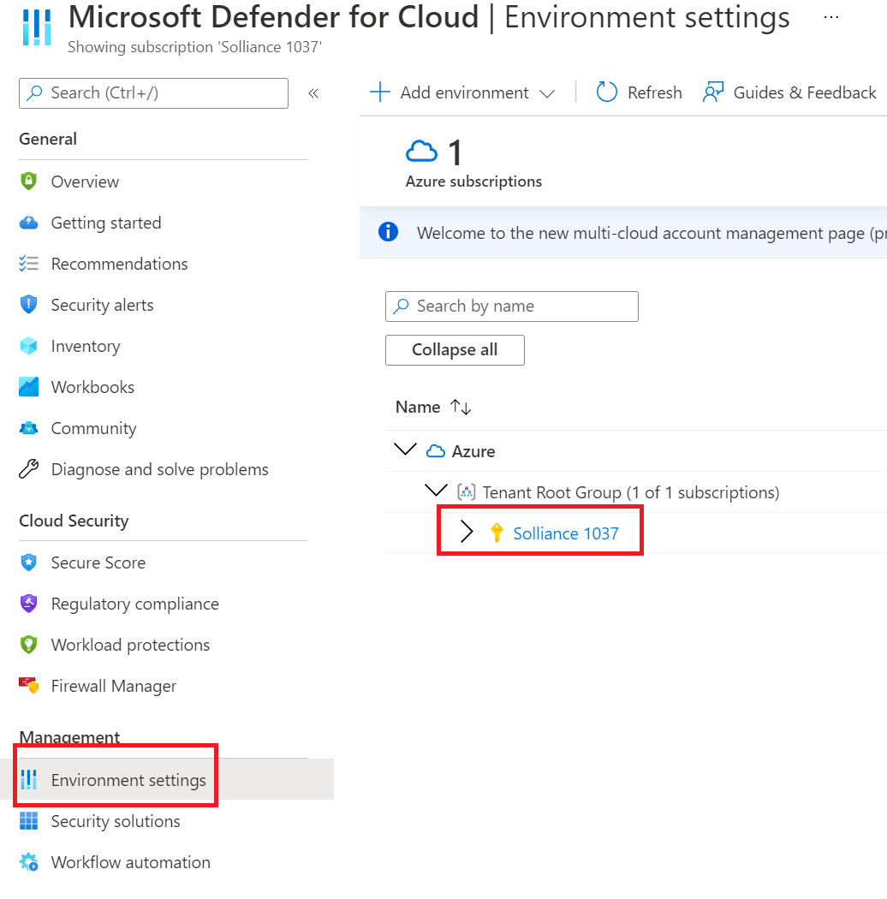
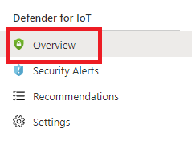
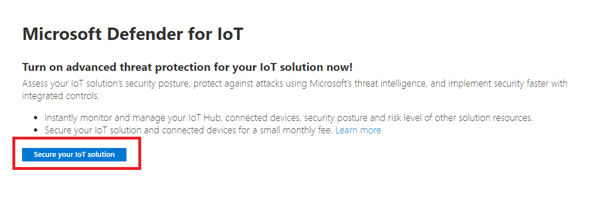
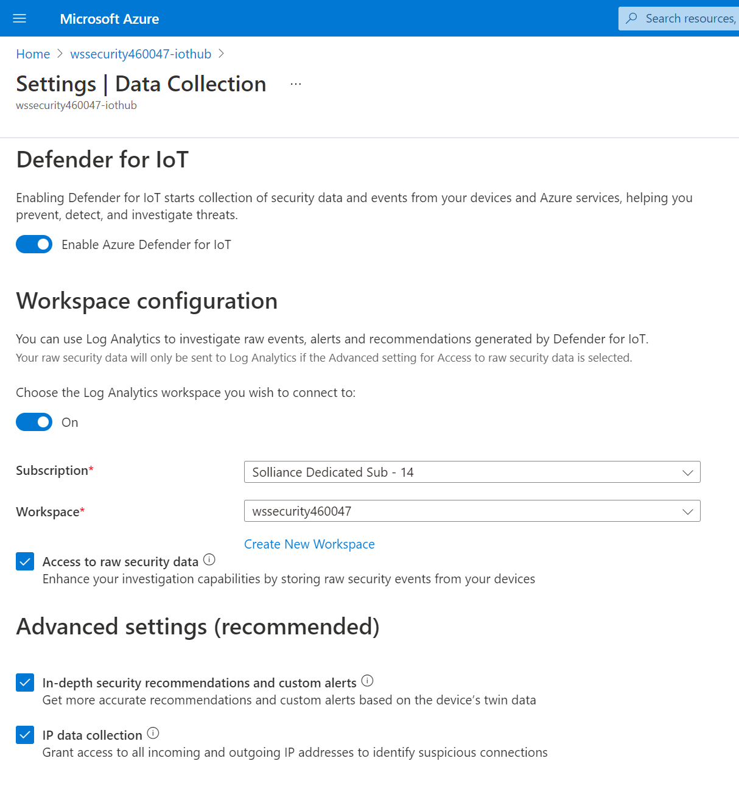

# Lab 1 : Microsoft Defender for Cloud : Execute Protections

## Exercise 1: Network Map

### Task 1: Network Map

1. Open the Azure Portal.
2. In the global search, search for `Microsoft Defender for Cloud`, then select it.
3. Under **Cloud Security**, select **Workload protections**.

    

4. Select **Network Map**.

    

5. Change all the filters to be **All**

   

6. Select the **wssecuritySUFFIX-win10** virtual machine node, review the recommendations

    

7. If you see any recommendations, select the **Management ports of virtual machines should be protected with just-in-time network access control** recommendation.

    > **Note** You may not see any recommendations.

8. Select **Fix**
9. Select **Save**
10. Navigate back to the Network map via the bread crumb
11. Select the **wssecuritySUFFIX-hub** virtual network node, review the recommendations
12. If you see any recommendations, select the **DDoS Protection Standard should be enabled** recommendation

    > **Note** You may not see any recommendations.

13. Select **Take Action**
14. Select **Enable**
15. Select the **wssecuritySUFFIX** protection plan
16. Select **Save**

## Exercise 2: Microsoft Defender for Cloud KQL Queries

### Task 1: VM Vulnerability Assessment

1. Browse to **Microsoft Defender for Cloud**
2. Under **General**, select **Recommendations**
3. Under the **Controls** section, expand the **Remediate vulnerabilities**
4. Select the **Vulnerabilities in your virtual machine should be remediated** item, you should see a set of recommendations.

    

5. In the Azure Portal, search for **Resource Graph Explorer**

    

6. In the query window, copy the following query:

        ```kql
        securityresources 
        | where type =~ "microsoft.security/assessments/subassessments"
        | extend assessmentKey=extract(@"(?i)providers/Microsoft.Security/assessments/([^/]*)", 1, id), subAssessmentId=tostring(properties.id), parentResourceId= extract("(.+)/providers/Microsoft.Security", 1, id)
        | extend resourceId = tostring(properties.resourceDetails.id)
        | extend subAssessmentName=tostring(properties.displayName),
            subAssessmentDescription=tostring(properties.description),
            subAssessmentRemediation=tostring(properties.remediation),
            subAssessmentCategory=tostring(properties.category),
            subAssessmentImpact=tostring(properties.impact),
            severity=tostring(properties.status.severity),
            status=tostring(properties.status.code),
            cause=tostring(properties.status.cause),
            statusDescription=tostring(properties.status.description),
            additionalData=tostring(properties.additionalData)
        | where assessmentKey == "1195afff-c881-495e-9bc5-1486211ae03f"
        | where status == "Unhealthy"
        | summarize numOfResources=dcount(resourceId), timeGenerated=arg_max(todatetime(properties.timeGenerated), additionalData) by assessmentKey, subAssessmentId, subAssessmentName, subAssessmentCategory, severity, status, cause, statusDescription, subAssessmentDescription, subAssessmentRemediation, subAssessmentImpact
        | extend high = iff(severity == "High", 3,0), medium = iff(severity == "Medium", 2, 0), low = iff(severity == "Low", 1 ,0)
        | extend all = high + medium + low
        | order by all desc, numOfResources desc
        ```

7. Press **Run query**
8. You should see the same results as in the Azure Portal.

    

### Task 2: SQL Vulnerability Assessment

1. Browse to **Microsoft Defender for Cloud**
2. Under **General**, select **Recommendations**
3. Under the **Controls** section, expand the **Remediate security configurations**
4. Select the **SQL databases should have vulnerability findings resolved** item, you should see a set of recommendations.

    

5. In the Azure Portal, search for **Resource Graph Explorer**
6. In the query window, run the following query:

        ```kql
        securityresources 
        | where type =~ "microsoft.security/assessments/subassessments"
        | extend assessmentKey=extract(@"(?i)providers/Microsoft.Security/assessments/([^/]*)", 1, id), subAssessmentId=tostring(properties.id), parentResourceId= extract("(.+)/providers/Microsoft.Security", 1, id)
        | extend resourceIdTemp = iff(properties.resourceDetails.id != "", properties.resourceDetails.id, extract("(.+)/providers/Microsoft.Security", 1, id))
        | extend resourceId = iff(properties.resourceDetails.source =~ "OnPremiseSql", strcat(resourceIdTemp, "/servers/", properties.resourceDetails.serverName, "/databases/" , properties.resourceDetails.databaseName), resourceIdTemp)
        | where assessmentKey == "82e20e14-edc5-4373-bfc4-f13121257c37"
        | extend subAssessmentName=tostring(properties.displayName),
            subAssessmentDescription=tostring(properties.description),
            subAssessmentRemediation=tostring(properties.remediation),
            subAssessmentCategory=tostring(properties.category),
            subAssessmentImpact=tostring(properties.impact),
            severity=tostring(properties.status.severity),
            status=tostring(properties.status.code),
            cause=tostring(properties.status.cause),
            additionalData=tostring(properties.additionalData)
        | summarize
                numOfResources=dcount(resourceId),
                (subAssessmentNameLatest, subAssessmentName)=arg_max(todatetime(properties.timeGenerated), subAssessmentName),
                (subAssessmentCategoryLatest, subAssessmentCategory)=arg_max(todatetime(properties.timeGenerated), subAssessmentCategory),
                (severityLatest, severity)=arg_max(todatetime(properties.timeGenerated), severity),
                (subAssessmentDescriptionLatest, subAssessmentDescription)=arg_max(todatetime(properties.timeGenerated), subAssessmentDescription),
                (subAssessmentRemediationLatest, subAssessmentRemediation)=arg_max(todatetime(properties.timeGenerated), subAssessmentRemediation),
                (subAssessmentImpactLatest, subAssessmentImpact)=arg_max(todatetime(properties.timeGenerated), subAssessmentImpact),
                (causeLatest, cause)=arg_max(todatetime(properties.timeGenerated), cause),
                (additionalDataLatest, additionalData)=arg_max(todatetime(properties.timeGenerated), additionalData),
                timeGenerated=max(todatetime(properties.timeGenerated))
            by assessmentKey, subAssessmentId, status
        | extend high = iff(severity == "High", 3,0), medium = iff(severity == "Medium", 2, 0), low = iff(severity == "Low", 1 ,0)
        | extend all = high + medium + low
        | order by all desc, numOfResources desc
        ```

7. You should see the same results as in the Azure Portal.

### Task 3: File Integrity

1. Browse to the **wssecuritySUFFIX** log analytics workspace
2. Under **General**, select **Logs**
3. Close any dialogs
4. Expand the **Change Tracking** category/solution, notice the two tables `ConfigurationChange` and `ConfigurationData`

    

5. To find changes to files that contain a path, run the following query:

        ```kql
        ConfigurationChange
        | where ConfigChangeType == "Files" and FileSystemPath contains @"c:\windows\system32\drivers\"
        ```

6. To find changes to windows services, run the following query:

        ```kql
        ConfigurationChange
        | where ConfigChangeType == "WindowsServices" and SvcName contains "w3svc" and SvcState == "Stopped"
        ```

7. To find changes to registry settings, run the following query:

        ```kql
        ConfigurationChange
        | where RegistryKey contains @"HKEY_LOCAL_MACHINE\\SYSTEM\\CurrentControlSet\\Services\\SharedAccess\\Parameters\\FirewallPolicy"
        ```

### Task 4: Container Image Scanning

1. Browse to the **wssecuritySUFFIX** log analytics workspace
2. Under **General**, select **Logs**
3. Close any dialogs
4. Run the following query:

        ```kql
        SecurityBaseline
        | where BaselineType == "Docker"
        | where AnalyzeResult == "Failed"
        | summarize arg_max(TimeGenerated, *) by CceId
        | project
            CceId,
            Description,
            Resource,
            ResourceGroup,
            RuleSeverity,
            ActualResult,
            BaselineType,
            Type,
            SubscriptionId,
            TenantId,
            ResourceId,
            ComputerEnvironment
        | order by RuleSeverity asc nulls last
        ```

    

    > **NOTE** If you don't see any recommendations, it is possible the images did not get deployed. The **wssecurity-linux-1** virtual machine is used to do this deployment.  If anything deploys incorrectly in the image via the Azure script extensions, you can check the Azure agent log files using:

        ```bash
        find /var/ba/waagent/custom-script/download -type d -exec chmod 755 {} \;
        
        sudo nano /var/lib/waagent/custom-script/download/0/stdout
        sudo nano /var/lib/waagent/custom-script/download/0/stderr
        ```

### Task 5: Adaptive Application Control

1. Browse to **Microsoft Defender for Cloud**
2. Under **Cloud Security**, select **Workload Protections**
3. At the bottom of the page, select **Adaptive application control**
4. Select the group with the most machines:

    

5. Select **Audit**, wait for the protection mode to be **Auditing**
6. Review each of the sections by expanding them.  You will likely not see any data for a few hours.
7. In the Azure Portal, search for **Resource Graph Explorer**
8. In the query window, run the following query to see application control events:

        ```kql
        securityresources
        | where type =~ 'microsoft.security/locations/alerts'
        | where properties.SystemAlertId contains 'application control' or properties.AlertDisplayName contains 'application control' or properties.ResourceIdentifiers contains 'application control'
        | where properties.Status in ('Active')
        | where properties.Severity in ('Low', 'Medium', 'High')
        | extend SeverityRank = case(
            properties.Severity == 'High', 3,
            properties.Severity == 'Medium', 2,
            properties.Severity == 'Low', 1,
            0
            )
        | sort by  SeverityRank desc, tostring(properties.SystemAlertId) asc
        | project-away SeverityRank
        | project id, subscriptionId, AlertDisplayName = properties.AlertDisplayName, AlertType = properties.AlertType, AlertUri = properties.AlertUri, Entities = properties.Entities, Intent = properties.Intent, IsIncident = properties.IsIncident, ResourceIdentifiers = properties.ResourceIdentifiers, Severity = properties.Severity, StartTimeUtc = properties.StartTimeUtc, Status = properties.Status, SystemAlertId = properties.SystemAlertId
        ```

### Task 6: Adaptive Network Hardening

You can review the adaptive network hardening recommendations via the Azure Resource Graph. This data takes 30 days to populate, so you may not see any results from the query.

1. In the Azure Portal, search for **Resource Graph Explorer**
2. In the query window, run the following query:

        ```kql
        securityresources 
        | where type =~ "microsoft.security/assessments"
        | extend resourceId = iff(properties.resourceDetails.Source =~ "azure", properties.resourceDetails.Id, iff(properties.resourceDetails.Source =~ "aws", properties.resourceDetails.AzureResourceId, extract("^(.+)/providers/Microsoft.Security/assessments/.+$",1,id)))
        | extend resourceName = extract(@"(.+)/(.+)", 2, resourceId)
        | extend resourceNameLower = tolower(resourceName)
        | extend assessmentKey = name
        | extend assessmentResourceDetails = properties.resourceDetails
        | extend regex_resourceId = extract_all(@"/providers/([^/]+)(?:/([^/]+)/[^/]+(?:/([^/]+)/[^/]+)?)?/([^/]+)/[^/]+$", resourceId)
        | extend providerName = regex_resourceId[0][0],
            mainType = iff(regex_resourceId[0][1] !~ "", strcat("/",regex_resourceId[0][1]), ""),
            extendedType = iff(regex_resourceId[0][2] !~ "", strcat("/",regex_resourceId[0][2]), ""),
            extendedSpecificType = iff(regex_resourceId[0][3] !~ "", strcat("/",regex_resourceId[0][3]), "")
        | extend type = tolower(strcat(providerName, mainType, extendedType, extendedSpecificType))
        | extend statusCode = tolower(properties.status.code)
        | extend statusCause = properties.status.cause
        | extend statusDescription = properties.status.description
        | extend severity = iff(isnotempty(properties.metadata.severity), properties.metadata.severity, "High")
        | extend healthy = iff(statusCode =~ "Healthy", 1, 0),
                low = iff(statusCode =~ "UnHealthy" and severity =~ "Low", 1, 0),
                medium = iff(statusCode =~ "UnHealthy" and severity =~ "Medium", 1, 0),
                high = iff(statusCode =~ "UnHealthy" and severity =~ "High", 1, 0),
                none = iff(statusCode =~ "notApplicable", 1, 0)
        | extend additionalData = iff(isnotempty(properties.additionalData),  properties.additionalData, "{}")
        | extend isResourceGroup = iff(tolower(resourceId) contains "/resourcegroups/" and isnotempty(type) == false, 1, 0)
        | extend isSubscription = iff(tolower(resourceId) contains "/subscriptions/" and isnotempty(type) == false and isResourceGroup == 0, 1, 0)
        | extend type = iff(isnotempty(type) == true, type, iff(isResourceGroup == 1, "$resourceGroup$", iff(isSubscription == 1, "$subscription$", type)))
        | extend securityState = iff(high > 0, 4,
            iff(medium > 0, 3,
            iff(low > 0, 2,
            iff(healthy > 0, 1,
            0))))
        | where assessmentKey in ("f9f0eed0-f143-47bf-b856-671ea2eeed62")
        | project subscriptionId, assessmentKey, resourceName, resourceId, statusCode, type, additionalData, securityState, statusCause, statusDescription, resourceNameLower, assessmentResourceDetails
        | order by resourceNameLower
        ```

### Task 7: JIT VM Access

1. Open the Azure Portal
2. Browse to the **wssecuritySUFFIX** log analytics workspace
3. Under **General**, select **Logs**
4. Close any dialogs
5. To find `deletion` activities, run the following query:

        ```kql
        AzureActivity
        | where ResourceProviderValue =~ "Microsoft.Security" 
        | where OperationNameValue =~ "Microsoft.Security/locations/jitNetworkAccessPolicies/delete" 
        ```

6. To find `initiation` activities, run the following query:

        ```kql
        AzureActivity
        | where TimeGenerated > ago(30d)
        | where OperationNameValue == "Microsoft.Security/locations/jitNetworkAccessPolicies/initiate/action"
        | extend activityStatusValue = toString(Properties d.activityStatusValue)
        | extend eventName = toString(Properties d.eventName)
        | extend Justification = toString(parse json(tostring(Properties d.eventProperties)).Justification)
        | extend User = toString(parse json(tostring(Properties d.eventProperties)).User)
        | summarize count(activityStatusValue) by activityStatusValue, eventName, Justification, User, TimeGenerated, ResourceId
        ```

### Task 8: Network Map

You can gain access to the data in the network map through the Azure Management REST endpoints.

1. Login to the **wssecuritySUFFIX-win10** virtual machine.

    > **NOTE** You will need to enable access via JIT

2. Open a PowerShell ISE window.
3. Copy into the window and run the following PowerShell script:

        ```PowerShell
        . C:\LabFiles\Common.ps1

        Login-AzureCredsPowerShell

        $azToken = Get-AzAccessToken -ResourceUrl "https://management.azure.com";

        $global:managementToken = $azToken.Token;

        $sub = Get-AzSubscription
        $subscriptionId = $sub.Id;

        $url = "https://management.azure.com/subscriptions/$subscriptionId/providers/Microsoft.Security/topologies?includeResourceInformation=true&api-version=2015-06-01-preview"

        $result = Invoke-RestMethod  -Uri $url -Method Get -ContentType "application/json" -Headers @{"Authorization"="Bearer $managementToken"};

        $result;

        $url = "https://management.azure.com/subscriptions/$subscriptionId/providers/Microsoft.Security/allowedConnections?api-version=2015-06-01-preview";

        $result = Invoke-RestMethod  -Uri $url -Method Get -ContentType "application/json" -Headers @{"Authorization"="Bearer $managementToken"};

        $result.value;
        ```

4. Review the results in the output.

## Exercise 3: Continuous Export (Storage Account)

### Task 1: Enable Continuous Export

1. Browse to Microsoft Defender for Cloud
2. Under **Management**, select **Environment settings**
3. Expand the management group, select the lab subscription

    

4. Under **Settings**, select **Continuous export**
5. Select the **Log Analytics workspace** tab
6. Check all the **Exported data types** checkboxes
7. Select the ***-security** resource group
8. For the target workspace, select **wssecuritySUFFIX**

    

9. Select **Save**

    > **Note** You can also deploy continuous export using Azure Policy

10. Browse to the **wssecuritySUFFIX** log analytics workspace
11. Under **General**, select **Logs**
12. Close any dialogs
13. After a few hours, the data will start to flow into the log analytics workspace, run the following KQL to query for security alerts:

    ```kql
    SecurityAlert
    ```

14. Run the following query to query for security recommendations:

    ```kql
    SecurityRecommendation
    ```

## Exercise 4: Microsoft Defender for IoT

### Task 1: Enable Microsoft Defender for IoT

1. Browse to the **wssecuritySUFFIX** IoT Hub
2. Under **Defender for IoT**, select **Overview**

    

3. Select **Secure your IoT solution**, then refresh the page

    

4. Under **Defender for IoT**, select **Settings**
5. Select **Data Collection**

    

6. For the workspace configuration, toggle to **On**
7. Select the lab subscription
8. Select the **wssecuritySUFFIX** workspace

    

9. Select **Save**

### Task 2: Microsoft Defender for IoT

1. Browse to **Microsoft Defender for Cloud**
2. Under **Cloud Security**, select **Workload protections**
3. Select **IoT Security**.  Review the blades, notice this IoT Security is very different from the IoT Security features on the IoT Hub.

## Reference Links

- [Network Map](https://docs.microsoft.com/en-us/azure/security-center/security-center-network-recommendations#network-map)
- [VM Vulnerability Assessments](https://docs.microsoft.com/en-us/azure/security-center/deploy-vulnerability-assessment-vm)
- [SQL Vulnerability Assessments](https://docs.microsoft.com/en-us/azure/azure-sql/database/sql-vulnerability-assessment)
- [Container Image Scanning](https://docs.microsoft.com/en-us/azure/security-center/defender-for-container-registries-introduction)
- [Adaptive Network Hardening](https://docs.microsoft.com/en-us/azure/security-center/security-center-adaptive-network-hardening)
- [JIT VM Access](https://docs.microsoft.com/en-us/azure/security-center/security-center-just-in-time?tabs=jit-config-asc%2Cjit-request-asc)
- [Azure Resource Graph](https://docs.microsoft.com/en-us/azure/governance/resource-graph/)
- [Microsoft Defender for IoT](https://docs.microsoft.com/en-us/azure/defender-for-iot/)
