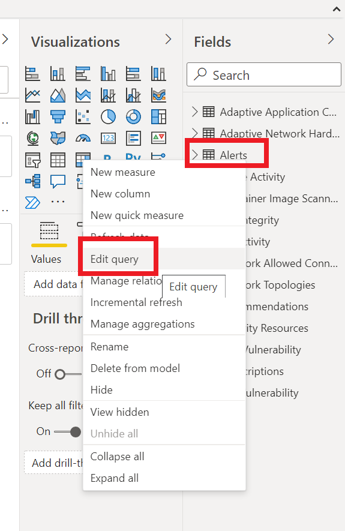
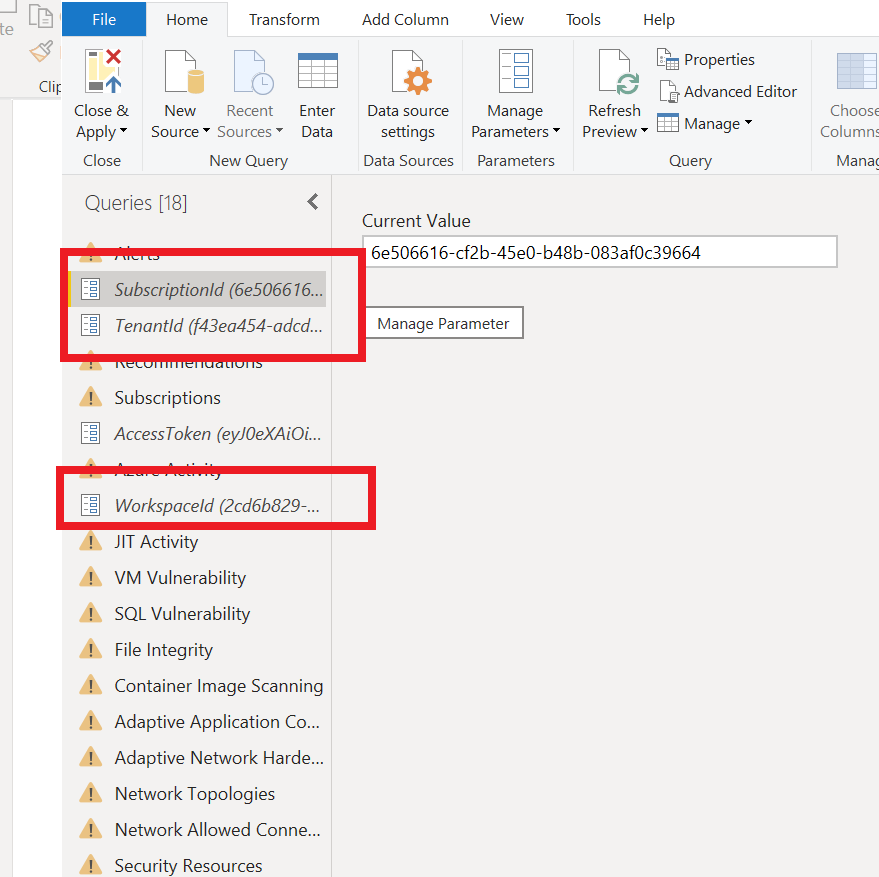

# Azure Security Center + Azure Defender : Lab 2 : REST APIs

## Exercise 1: REST APIs

### Task 1: Log Analytics

1. Log into the **wssecuritySUFFIX-win10** virtual machine
2. Open a Windows PowerShell ISE window
3. Run the following script:

    ```PowerShell
    . C:\LabFiles\AzureCreds.ps1

    $userName = $AzureUserName                # READ FROM FILE
    $password = $AzurePassword                # READ FROM FILE
    $clientId = $TokenGeneratorClientId       # READ FROM FILE
    $global:sqlPassword = $AzureSQLPassword          # READ FROM FILE

    $securePassword = $password | ConvertTo-SecureString -AsPlainText -Force
    $cred = new-object -typename System.Management.Automation.PSCredential -argumentlist $userName, $SecurePassword

    Connect-AzAccount -Credential $cred | Out-Null

    $azToken = Get-AzAccessToken;

    $token = $azToken.Token;
    $global:loginDomain = $azToken.TenantId;

    $ropcBodyCore = "client_id=$($clientId)&username=$($userName)&password=$($password)&grant_type=password"
    $global:ropcBodyLogs = "$($ropcBodyCore)&scope=https://api.loganalytics.io/.default"

    $result = Invoke-RestMethod  -Uri "https://login.microsoftonline.com/$($global:logindomain)/oauth2/v2.0/token" `
        -Method POST -Body $global:ropcBodyLogs -ContentType "application/x-www-form-urlencoded"

    $global:logsToken = $result.access_token

    $rg = (Get-AzResourceGroup | Where-Object { $_.ResourceGroupName -like "*-security" });
    $resourceGroupName = $rg.ResourceGroupName
    $deploymentId =  (Get-AzResourceGroup -Name $resourceGroupName).Tags["DeploymentId"]

    $wsName = "wssecurity" + $deploymentId;
    $ws = Get-AzOperationalInsightsWorkspace -Name $wsName -ResourceGroup $resourceGroupName;
    $workspaceId = $ws.CustomerId;
    $keys = Get-AzOperationalInsightsWorkspaceSharedKey -ResourceGroup $resourceGroupName -Name $wsName;
    $workspaceKey = $keys.PrimarySharedKey;

    $url = "https://api.loganalytics.io/v1/workspaces/" + $WorkspaceId + "/query";

    $query = "AzureActivity";

    $logQueryBody = @{"query" = $query} | convertTo-Json

    $result = Invoke-RestMethod  -Uri $url -Method POST -Body $logQueryBody -ContentType "application/json" -Headers @{"Authorization"="Bearer $logsToken"};

    $result;
    ```

4. Review the results from the REST api call. You can make calls from your own applications to integrate with the Log Analytics data.

### Task 2: Azure Resource Graph Queries

1. Open a Windows PowerShell window
2. Run the following script:

    ```PowerShell
    . C:\LabFiles\AzureCreds.ps1

    $userName = $AzureUserName                # READ FROM FILE
    $password = $AzurePassword                # READ FROM FILE
    $clientId = $TokenGeneratorClientId       # READ FROM FILE
    $global:sqlPassword = $AzureSQLPassword          # READ FROM FILE

    $securePassword = $password | ConvertTo-SecureString -AsPlainText -Force
    $cred = new-object -typename System.Management.Automation.PSCredential -argumentlist $userName, $SecurePassword

    Connect-AzAccount -Credential $cred | Out-Null

    $azToken = Get-AzAccessToken;
    $token = $azToken.Token;
    $global:loginDomain = $azToken.TenantId;

    $ropcBodyCore = "client_id=$($clientId)&username=$($userName)&password=$($password)&grant_type=password"
    $global:ropcBodyManagement = "$($ropcBodyCore)&scope=https://management.azure.com/.default"

    $result = Invoke-RestMethod  -Uri "https://login.microsoftonline.com/$($global:logindomain)/oauth2/v2.0/token" `
        -Method POST -Body $global:ropcBodyManagement -ContentType "application/x-www-form-urlencoded"

    $global:managementToken = $result.access_token

    $sub = Get-AzSubscription
    $subscriptionId = $sub.Id;

    $url = "https://management.azure.com/providers/Microsoft.ResourceGraph/resources?api-version=2018-09-01-preview";

    $query = "securityresources";

    $logQueryBody = @{"options" = $null; "subscriptions" = @( $subscriptionId); "query" = $query} | convertTo-Json

    $result = Invoke-RestMethod  -Uri $url -Method POST -Body $logQueryBody -ContentType "application/json" -Headers @{"Authorization"="Bearer $managementToken"};

    $result;

    ```

## Exercise 2: Visualize Recommendations with Power BI

### Task 1: Create KQL Query

1. Open the Azure Portal
2. Browse to the log analytics workspace
3. Under **General**, select **Logs**
4. Run the following query

    ```kql
    AzureActivity
    ```

5. Select **Export->Export to Power BI (M Query)**
6. Open the downloaded file
7. Follow in the instructions in the downloaded file

### Task 2: Export to Power BI

1. Open the `/artifacts/day-01/Azure Defender.pbix` file
2. Right-click the `Alerts` data source, select **Edit**

    

3. Select the `Alerts` data source, in the ribbon, select **Advanced Editor**.
4. Review the query.  

    

5. Repeat for all the data sources in the Power BI report.
6. Update the SubscriptionId, TenantId and WorkspaceId with the lab details:

   

7. Using the following PowerShell, generate a new `https://management.azure.com` access token, replace it in the report:

    ```PowerShell
    #login so you can get a token
    az login -u #USERNAME# -p #PASSWORD#

    #get an access token...
    $tokenValue = ((az account get-access-token --resource https://management.azure.com) | ConvertFrom-Json).accessToken

    $tokenValue
    ```

8. Select **Close & Apply**, when prompted, enter your lab credentials
9. You should see all the tabs update with Azure Defender related items. Review each tab.

## Reference Links

- [Azure Resource Graph APIs](https://docs.microsoft.com/en-us/rest/api/azure-resourcegraph/)
- [Azure Log Analytics API](https://dev.loganalytics.io/)
