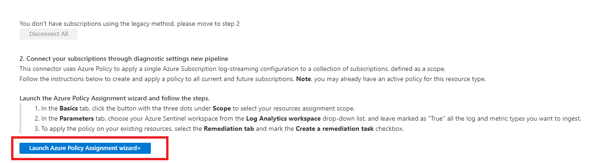
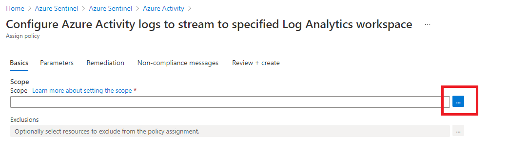
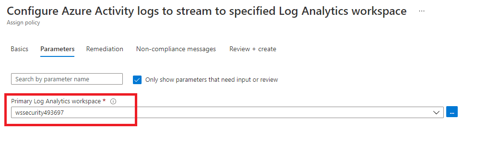
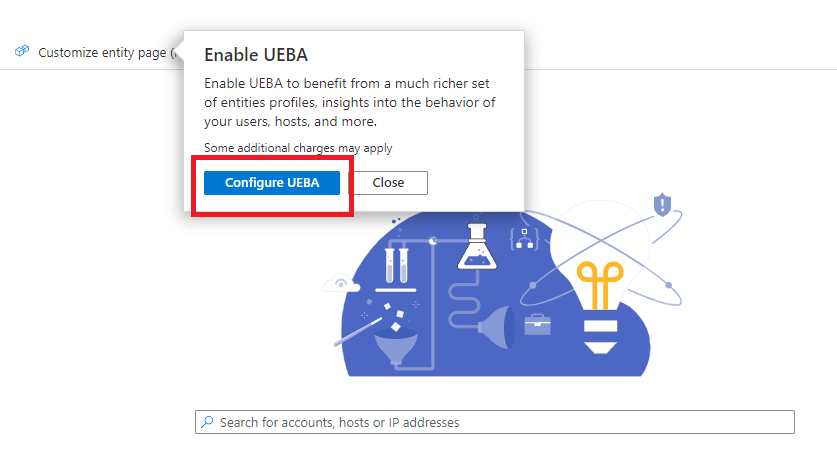
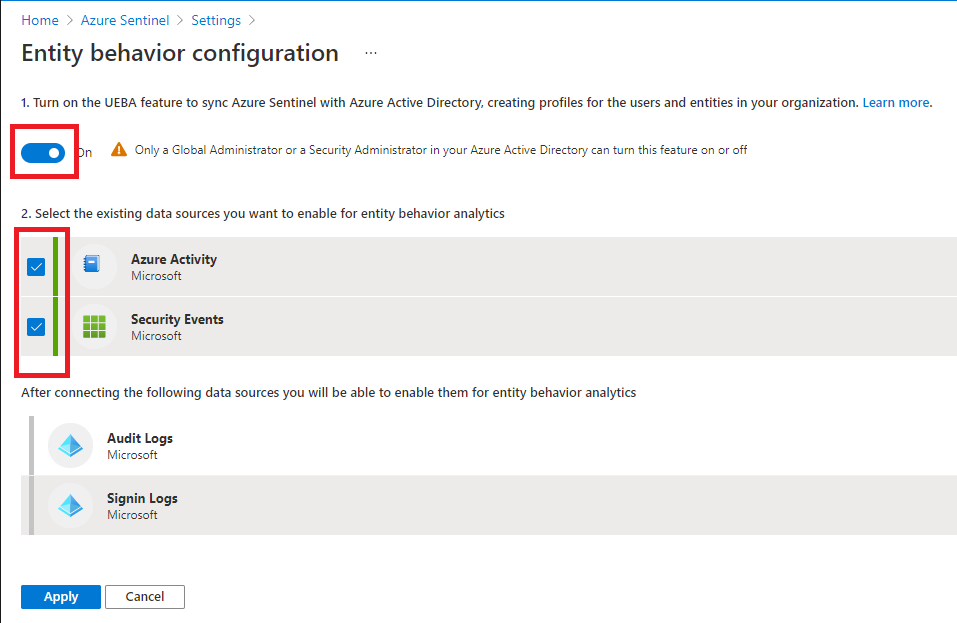
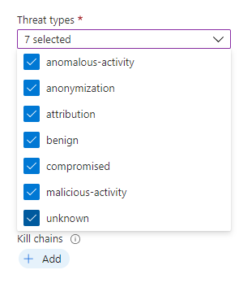
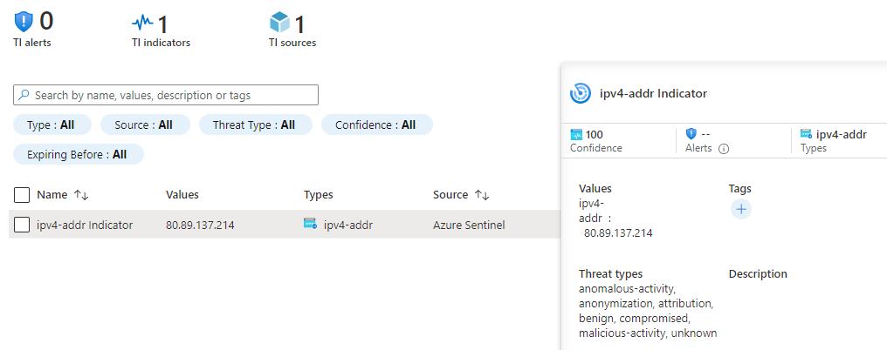
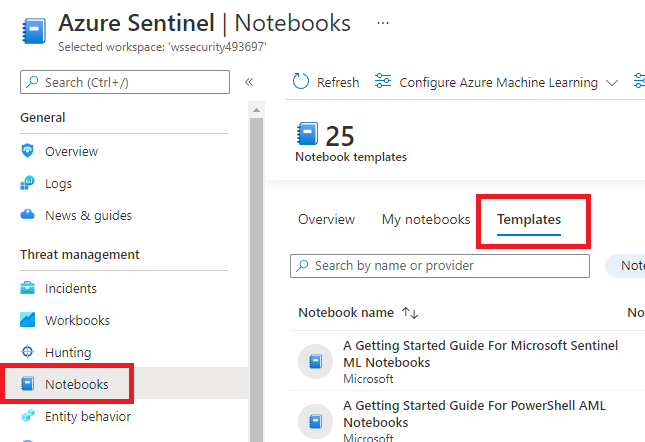
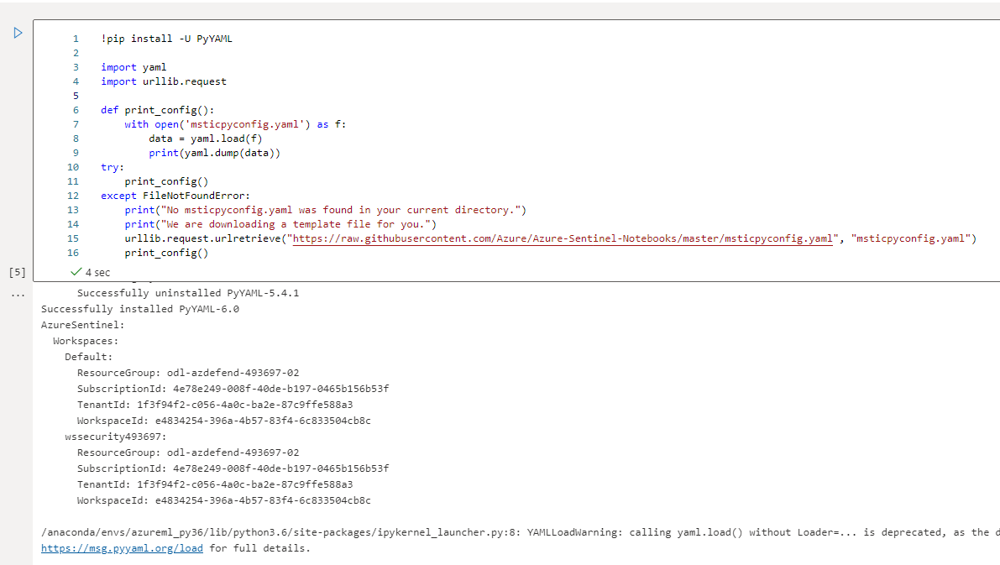
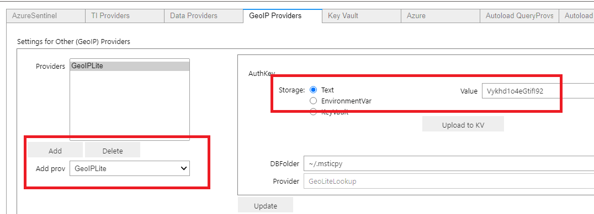

# Lab 3 : Configure Sentinel and Defender Integration

## Exercise 1 : Microsoft Sentinel Basics

1. Open the Azure Portal in your **paw-1** virtual machine
2. Search for and select **Microsoft Sentinel**

    

3. Select the **wssecuritySUFFIX** log analytics workspace

    

4. Under **General**, select **Logs**
5. If prompted with any dialogs, close them.
6. You should see some queries that were run previously when you were exploring Log Analytics
7. Take a few minutes to explore the various Microsoft Sentinel blade items

    

## Exercise 2 : Microsoft Sentinel Data Sources

### Task 1: Enable Azure Active Directory Connector

1. In the Microsoft Sentinel blade, under **Configuration**, select **Data connectors**
2. Select **Azure Active Directory**

    

3. In the side dialog, notice the Data Types that will be imported (`SigninLogs`, `AuditLogs`, etc)
4. Select **Open connector page**

    

    > **NOTE** You would need to have `global administrator` or `security administrator` access to the Azure AD tenant in order to make the connection.

5. Select the **Launch Azure Policy Assignment wizard**

    

6. For the scope, select the three dots (ellipses)

    

7. Select the subscription, then click **Select**

    

8. Select **Next**
9. For the workspace, select the **wssecuritySUFFIX** workspace

    

10. Select **Review + create**
11. Select **Create**

### Task 2: Enable Microsoft Defender Connector

1. Navigate back to Microsoft Sentinel blade, select **Microsoft Defender for Cloud**
2. Select **Open connector page**
3. Select your subscription, then select **Connect**
4. In the dialog, select **OK**
5. Select **Enable** to create incidents

    

### Task 3: Enable Microsoft 365 Defender

1. Navigate back to Microsoft Sentinel blade, select **Microsoft 365 Defender**
2. Select **Open connector page**
3. Select **Connect incidents & alerts**
4. Ensure the **Turn off all Microsoft incident creation rules...** checkbox is selected
5. Check all the checkboxes, then select **Apply Changes**

### Task 4: Enable Cloud App Security

1. Navigate back to Microsoft Sentinel blade, select **Microsoft Defender for Cloud Apps**
2. Select **Open connector page**
3. Select **Cloud Discovery Logs** checkbox
4. Select **Apply Changes**

### Task 5: Enable Security Events

1. Navigate back to Microsoft Sentinel blade, select **Security Events via Legacy Agent**
2. Select **Open connector page**
3. Select **All Events** radio button
4. Select **Apply Changes**

### Task 6: Enable DNS Events

1. Navigate back to Microsoft Sentinel blade, select **DNS (Preview)**
2. Select **Open connector page**
3. Select **Install Solution** radio button

### Task 7: Enable Windows Firewall

1. Navigate back to Microsoft Sentinel blade, select **Windows Firewall**
2. Select **Open connector page**
3. Select **Install Solution** radio button

### Task 8: Enable Defender for Endpoint

1. Navigate back to Microsoft Sentinel blade, select **Microsoft Defender for Endpoint**
2. Select **Open connector page**
3. Notice that the connector is already connected due to the parent connector **Microsoft 365 Defender** being connected

    

## Exercise 3 : Microsoft Sentinel Workbooks

1. In the Microsoft Sentinel blade, under **Threat Management**, select **Workbooks**
2. Select **Azure Defender for IoT Alerts**

   

3. Select **Save**
4. Leave the default selected workbook location, select **OK**
5. Select **View saved workbook**

    

    > **NOTE** You would need to have setup the IoT labs in order to see events\data in this workbook.

6. Browse back to the Sentinel Workbooks blade
7. Select **Microsoft Web Application (WAF)- firewall events**
8. Select **Save**

    

9. Leave the selected workbook location, select **OK**
10. Select **View saved workbook**

    > **NOTE** You would need to have setup the Web Application Firewall in order to see events\data in this workbook.

11. Browse back to the Sentinel Workbooks blade
12. Select **MITRE ATT&CK Workbook**
13. Select **Save**
14. Leave the selected workbook location, select **OK**
15. Select **View saved workbook**
16. Click through the various tabs and review the pre-built reports based on MITRE.

## Exercise 4 : Microsoft Sentinel Hunting

1. In the Microsoft Sentinel blade, select **Hunting**
2. Review the page, notice it has several pre-built queries for `hunting` log data for events that are of interest

    

3. Select one of the items, it will display the details of what that item does:

    

4. Select **Run all queries**, you should see all queries start to execute.

    > **Note** You can run these queries, then run them again at a future time to see what the delta is. Typically you would sort based on the number and then explore further if you see results.

## Exercise 5 : Microsoft Sentinel Entity Behavior

1. In the Microsoft Sentinel blade, select **Entity Behavior**
2. Select **Configure UEBA**

    

3. Again, select **Configure UEBA**

    

4. Set the toggle to **On**
5. Select the **Azure Activity** and **Security Events** table

    

6. Select **Apply**
7. Ensure the **Anomalies** toggle is set to **On**

    

    > **NOTE** This feature allows you to track based on special types of entities such as Users, Resources, IP Address, etc. It must be enabled by a global admin, any unfortunately our lab environment does not allow for this.

8. Expand the **Playbook permissions**
9. Select **Configure permissions**

    

10. Select all the resource groups
11. Select **Apply**

## Exercise 6 : Threat Intelligence

1. In the Microsoft Sentinel blade, under **Threat Management**, select **Threat intelligence**
2. In the top navigation, select **+Add new**

    

3. For the type, select **ipv4-addr**
4. For the address type **80.89.137.214**

    > **NOTE** This is a known bad ip address originating from Russia and injected into the Microsoft Defender for Cloud and Sentinel logs from previous steps.

5. For the threat types, select all options

    

6. For the confidence, move the scroll bar to **100**
7. For the valid from, select today's date

    

8. Select **Apply**, you should see a new threat indicator:

    

9. Any time this IP is found in log data, an alert will be generated.
10. In a PowerShell ISE window, oOpen the `c:\LabFiles\sentinel-defender-workshop-400\artifacts\day-01\CreateIoCs.ps1` file
11. Press **F5** to run the script
12. Refresh the Threat Intelligence, you should see some new IPs added.

    > **NOTE** You will need to ensure that you see the IPs added as other labs will reference these IoCs later.

## Exercise 7 : Microsoft Sentinel Notebooks

### Task 1: Import Notebook

1. In the **Microsoft Sentinel** blade, under **Threat Management**, select **Notebooks**.
2. Select the **Templates** tab, review the list of sample notebooks

    

3. Select the **A Getting Started Guide for Microsoft Sentinel ML Notebooks**, in the dialog, select **Clone notebook template**

    

4. Select the lab machine learning workspace, then select **Save**

    

5. Select **Launch notebook**
6. If not already logged in, enter your lab Azure credentials. If prompted, close any dialogs.
7. Select the machine learning workspace, then select **Get Started**

    

8. In the right navigation, select **Notebooks**
9. In the Compute area, select the **+** sign
10. For the name, type **main**
11. Select the **Standard_DS3_v2**

    

12. Select **Create**. Continue on while the compute is being provisioned.
13. In the notebooks section, select the **plus** button, then **Upload Files**

    

14. Upload the `c:\LabFiles\sentinel-defender-workshop-400\artifacts\day-01\Microsoft Sentinel ML.ipynb` file to the workspace, when prompted, check both checked boxes, then select **Upload**
15. Browse to your **wssecuritySUFFIX** log analytics workspace, copy the workspace id for later use.
16. In another browser tab, navigate to the [Azure Active Directory page](https://portal.azure.com/#blade/Microsoft_AAD_IAM/ActiveDirectoryMenuBlade/Overview), copy your `Tenant ID` for use later.

    

### Task 2: Create VirusTotal account

1. Open [VirusTotal web site](https://www.virustotal.com/gui/join-us), if you already have an account, [login to it](https://www.virustotal.com/gui)
   - Fill in the form details, select **Join us**
2. Log in to the website, in the top right navigation, select your user icon
3. Select **API Key**

    

4. Copy the API Key for later steps

    

### Task 3: Create MaxMind account

1. Open the MaxMind [sign up page](https://www.maxmind.com/en/geolite2/signup). If you already have an account, [login to it](https://www.maxmind.com/en/account/login)
   - Fill out the sign up form, select **Continue**
2. Login to the MaxMind site
3. Select **Managed License Keys**, then select **Generate new license key**

    

4. Select **No**
5. Select **Confirm**

### Task 4: Execute a Hunt

1. Switch back to the uploaded Machine Learning NoteBook, the compute should be provisioned
2. If prompted, select **Start Jupyter kernel**
3. If prompted, select **Authenticate**

    

4. For each cell select **Run** and follow each of the cells as they are executed. **DO NOT** run the entire notebook.

    

5. Some cells will output information:

    

    

6. Some will present UIs and allow you to enter configuration information such as the Workspace, TenantId and API keys:

    

7. Enter your Virus Total information:

   - Select the **TI Proviers** tab, select "VirusTotal" from the **Add prov** drop down
   - Click the **Add** button
   - In the left-side Details panel select **Text** as the Storage option.
   - Paste the API key in the Value text box.
   - Click the **Update**

        

    - Select the **GeoIP Providers** tab
    - Select the **GeoIPLite** provider from the Add prov drop-down
    - Click **Add**
    - Select **Text** Storage and paste the license (API/Auth) key into the text box
    - Click **Update**
    - Click **Save Settings** to write your settings to your configuration.

        

8. Validate the configuration:

    

9. Another cell will ask you to generate an access token

    

   - Copy the device code

   - Open a browser window to `https://microsoft.com/devicelogin`

   - Paste the device code

   - Login using the lab username and password

   - Select **Continue**

10. Continue to run a few more cells, you should see a cell output the Log Analytics table and the `SigninLogs` schema:

    

11. One cell will display the queries available to you

    

12. The next cell will display Kusto query details

    

13. You can even use a query browser:

    

14. The next cell will execute a query passing in parameters:

    

15. Run the remaining cells, you will make calls to the external API providers to enrich the log data with threat levels and IP Address analysis

## Exercise 8 : Export Log Analytics data to Azure Storage

In this exercise you will setup an export rule to send log data to Azure Storage as a backup.

### Task 1 : Create Export Rule

1. Open the `\labfiles\sentinel-defender-workshop-400\artifacts\day-01\ExportLogsToStorage.ps1` PowerShell script in a PowerShell ISE.
2. Review the script, notice the environment values have already been set for you.
3. Press **F5** to run the script, when prompted, enter your lab credentials.
4. You should get a json response back.

    

### Task 2 : Review data

1. Switch to the Azure Portal.
2. Browse to the lab resource group.
3. Select the **wssecuritySUFFIX** storage account.
4. Under **Data storage**, select **Containers**.
5. After some log data is received, you can review the log data sent to the storage account.

    

### Task 3 : Query data with Visual Studio Code + Notebooks

1. Open Visual Studio Code
2. Open the `\labfiles\sentinel-defender-workshop-400\artifacts\day-01\ExportLogsToStorage.ipynb` notebook
3. When prompted, select **Install** for the recommended python extension, you should see the **Jupyter** extension get installed.

    

4. Switch back to the notebook, select the first cell
5. Press the Run button, select the **Python 3.10.x** instance.
6. Select **Install** when prompted

    

7. Run each cell in the notebook (note some cells can take up to 5 minutes to run)
8. In the last cell, you should see the data get loaded from the storage account and then displayed to the output.

    

## Exercise 9 : Exporting Alerts via Logic Apps

You can forward alerts from Sentinel to other SIEMs using the Sentinel APIs and Logic Apps.

### Task 1 : Review the export logic app

1. Open the Azure Portal
2. Browse to your lab resource group
3. Select the `get-sentinelalertsevidence` logic app

    

4. Select **Edit**
5. Review the steps of the logic app, notice that it exports data from Sentinel and then forwards it to an Event Hub.

    > **NOTE** Most SIEM systems can consume data from Event Hubs which would allow you to integrate your log analytics data with them. Reference the following:

- [ArcSight](https://community.microfocus.com/t5/ArcSight-Connectors/SmartConnector-for-Microsoft-Azure-Monitor-Event-Hub/ta-p/1671292)
- [LogRhythm](https://docs.logrhythm.com/docs/OCbeats/azure-event-hubs-beat-6-0-2)
- [McAfee](https://docs.mcafee.com/bundle/enterprise-security-manager-data-sources-configuration-reference-guide/page/GUID-B5374BE7-10DF-4869-B189-456E62072398.html)
- [QRadar](https://www.ibm.com/support/knowledgecenter/SS42VS_DSM/com.ibm.dsm.doc/t_dsm_guide_microsoft_azure_enable_event_hubs.html)
- [Splunk](https://docs.splunk.com/Documentation/AddOns/released/MSCloudServices/Configureeventhubs)

## Reference Links

- [What is Microsoft Sentinel](https://docs.microsoft.com/en-us/azure/sentinel/overview)
- [Investigate incidents with Microsoft Sentinel](https://docs.microsoft.com/en-us/azure/sentinel/tutorial-investigate-cases)
- Microsoft Sentinel Notebooks
- [Enrich Microsoft Sentinel security incidents with the RiskIQ Intelligence Connector](https://techcommunity.microsoft.com/t5/azure-sentinel/enrich-azure-sentinel-security-incidents-with-the-riskiq/ba-p/1534412)

## Resources

- https://docs.microsoft.com/en-us/microsoft-365/security/defender-endpoint/investigate-alerts?view=o365-worldwide
