# Microsoft Defender for Cloud : Lab 2 : Log Analytics Customization

This lab will walk you through how to create custom logs in your host machines and then send those custom logs to Azure Log Analytics.

## Exercise 1: Log Analytics Customization

All of the following tasks (including browsing the Azure Portal) should be performed from the **paw-1** lab virtual machine.

### Task 1: Add custom logs

1. Inside the **wssecuritySUFFIX-paw-1** virtual machine, open the Azure Portal in Chrome.
2. Login using your lab credentials.
3. Browse to the **-wssecurity** resource group.
4. Select the **wssecuritySUFFIX** log analytics workspace.

    

5. Under **Settings**, select **Agents Configuration**.
6. Select **+ Add windows event log**.
7. Type **Application**, then select the **+ Add windows event log** button
8. Type **System**, then select the **+ Add windows event log** button
9. Type **Microsoft-Windows-Sysmon/Operation**, then select the **Apply** button

    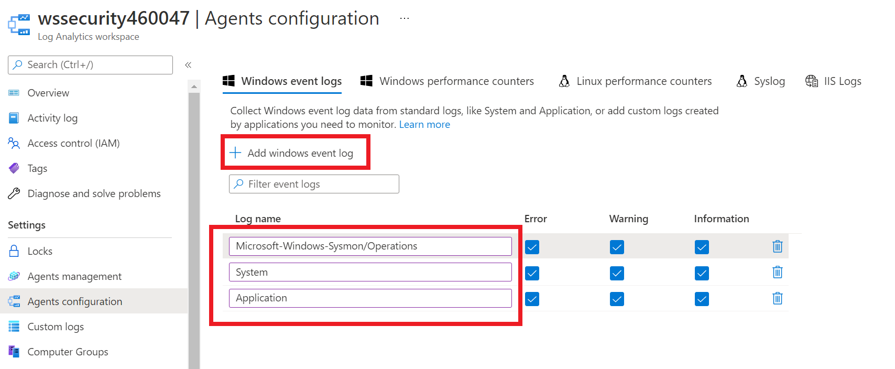

10. Select the **Windows performance counters** tab
11. Select **Add recommended counters**

    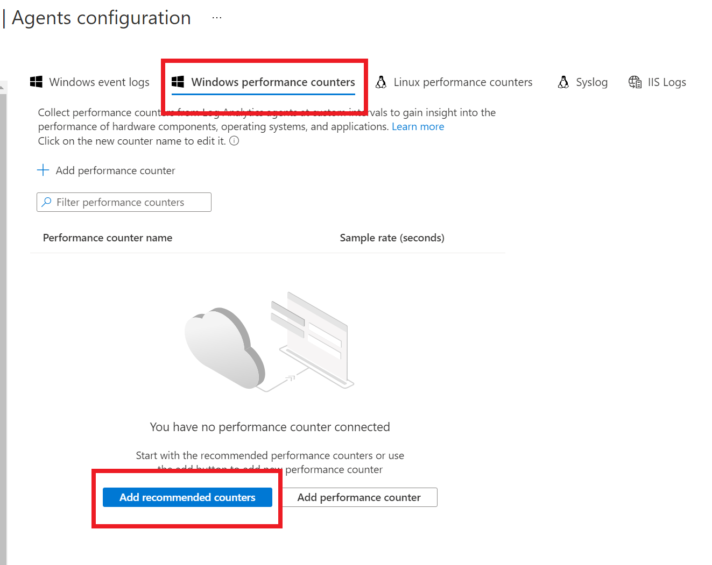

12. Select **Apply**
13. Select the **Linux performance counters** tab
14. Select **Add recommended counters**
15. Select **Apply**
16. Under **Settings**, select **Custom logs**.
17. Click **+ Add custom log** to open the Custom Log Wizard.

    > **NOTE** By default, all configuration changes are automatically pushed to all agents. For Linux agents, a configuration file is sent to the Fluentd data collector.

    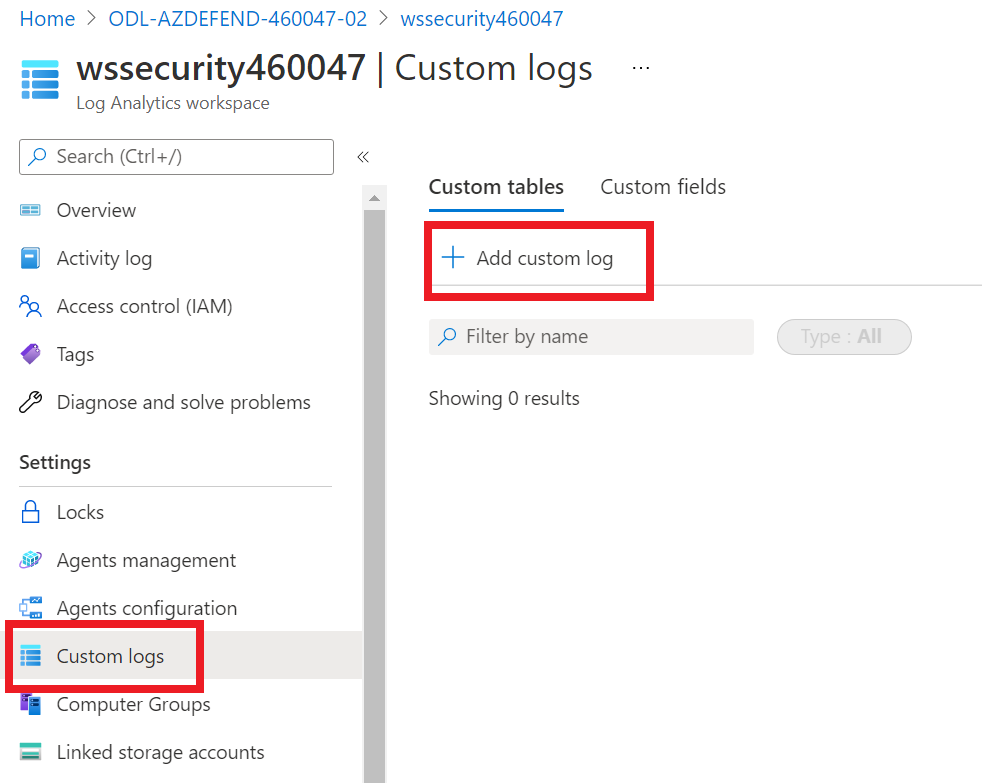

18. Select **Choose File\Browse** and browse to the **c:\lab files\sentinel-defender-workshop-400\artifacts\day-02\logfile.txt** sample file.
19. Select **Next**. The Custom Log Wizard will upload the file and list the records that it identifies.
20. On the `Select record delimiter`, select **Timestamp**
21. Select **YYYY-MM-DD HH:MM:SS**

    

22. Select **Next**
23. For the log collection paths, select **Windows**, then type **C:\logs\\*.log**

    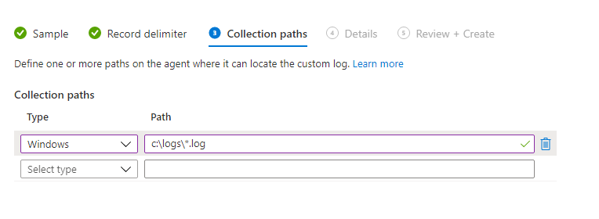

24. Select **Next**
25. For the name, type **CustomSecurity**

    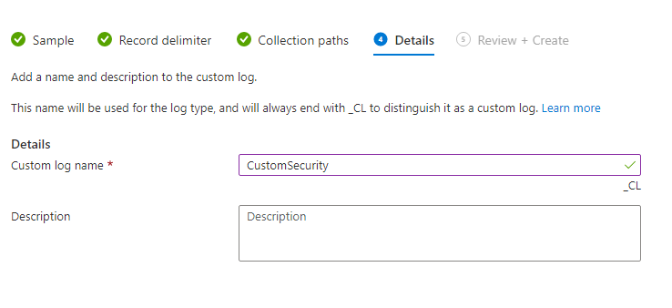

26. Select **Next**
27. Select **Create**

### Task 2: Ensure VM Connections

1. Under **Workspcae Data Sources**, select **Virtual Machines**
2. Make sure all the virtual machines are connected to the workspace
3. If they are not connected, un-connect them and re-connect to the **wssecuritySUFFIX** workspace

    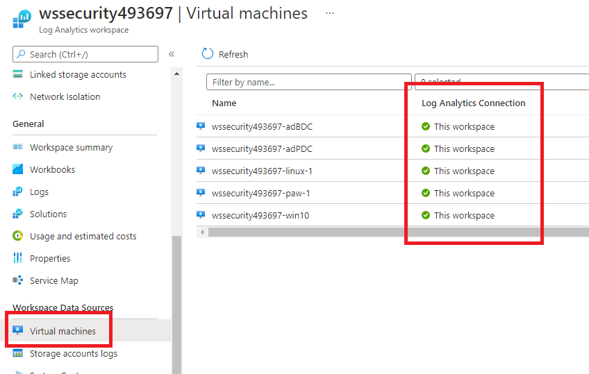

### Task 3: Generate some log data

1. In the **Paw-1** virtual machine, copy the **c:\lab files\sentinel-defender-workshop-400\artifacts\day-02\logs-01** folder contents to the **c:\logs** folder

    > **NOTE** If the folder does not exist, create it.

### Task 4: Setup Sysmon

1. From the **paw-1** virtual machine, unzip the **c:\labfiles\sentinel-defender-workshop-400\artifacts\day-02\sysmon.zip** file
2. Right-click it and select **Extract All**, then select **Extract**
3. Open a command prompt, run the following command:

    ```cmd
    cd c:\labfiles\sentinel-defender-workshop-400\artifacts\day-02\sysmon
    sysmon -accepteula -I
    ```

    > **NOTE** Since we enabled the log collection in a previous step, all sysmon logs will be ingested into Log Analytics.

### Task 5: Search custom logs #1

1. Switch back to the Azure Portal and browse to the log analytics workspace
2. Under **General**, Select **Logs**
3. If prompted, select **Get started**, toggle the **Always show Queries** checkbox, then close the dialog that opens
4. In the query text area, type the following:

    ```sql
    Heartbeat | where OSType == 'Windows'| summarize arg_max(TimeGenerated, *) by SourceComputerId | sort by Computer | render table
    ```

5. You should see the **paw-1** machine displayed. If you do not see it, wait for a few more minutes.  Refresh the query until you see the machine displayed as a result.

    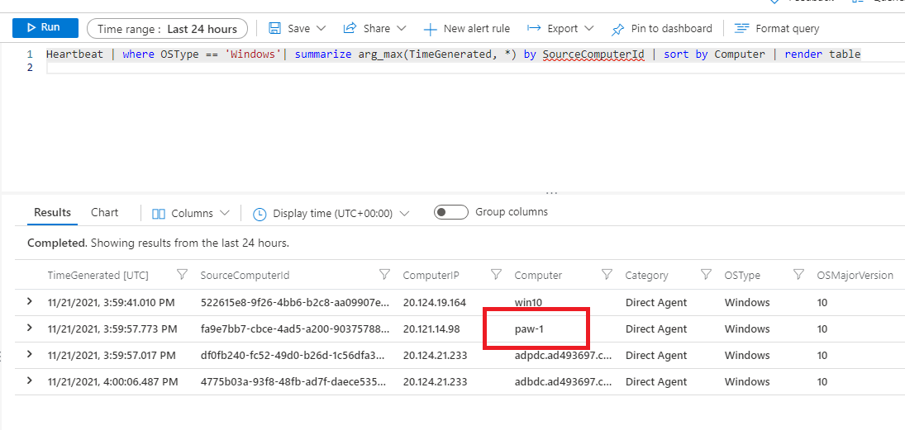

6. In the query text area, type the following:

    ```sql
    CustomSecurity_CL
    ```

    > **NOTE** It could take 5-10 minutes before you see custom log data. Azure Monitor will collect new entries from each custom log approximately every 5 minutes.

7. Depending on when the lab was created, you may need to change the `Time range` to see results:

   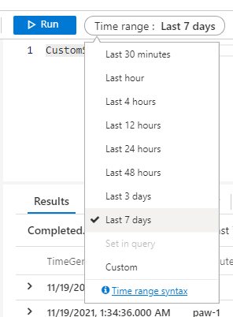

8. You should see the following results, notice the **RawData** column.

    

9. You can manually break out the information using Kusto functions. Run the following query:

    ```sql
    CustomSecurity_CL
    | extend CSVFields  = split(RawData, ',')
    | extend EventTime  = todatetime(CSVFields[0])
    | extend Code       = tostring(CSVFields[1])
    | extend Status     = tostring(CSVFields[2])
    | extend Message    = tostring(CSVFields[3])
    | summarize count() by Status,Code
    ```

    

    > **NOTE** We would like to expand this out without having to parse it so we'll create Custom Fields in the next task.

### Task 7: Create Custom Fields

1. Run the following query again:

    ```sql
    CustomSecurity_CL
    ```

2. Expand the first record's properties by clicking the **>**.

3. Select the ellipse to the left of the top property of the record, then select **Extract fields from**.

    

    > **NOTE** If you get an error, press **Refresh**

4. The Field Extraction Wizard is opened, and the record you selected is displayed in the Main Example column. The custom field will be defined for those records with the same values in the properties that are selected.

5. With your mouse, select the Date part of the raw data

    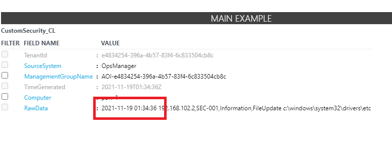

6. Type **LogDate_CF** for the field title
7. For the field type, select **Date/Time (ISO 8601 Format)**
8. Select **Extract**

    

9. Select the IP part of the raw data
10. Select **Extract**
11. Select **Save extraction**
12. Select the ellipse to the left of the top property of the record, then select **Extract fields from**.
13. Type **IP_CF** for the field title
14. For the field type, select **Text**
15. Select **Extract**

    

16. Select **Save extraction**

    > **Note** Custom fields will not be applied to any data that already been collected

17. Copy the **c:\lab files\security-workshop\artifacts\logs-02** folder contents to the **c:\logs** folder
18. Run the following query to show data based on a specific IP address:

    ```sql
    CustomSecurity_CL
    | where IP_CF == "203.160.71.100"
    ```

> **Note** You may need to replace the IP with one identified in the logs if it has changed between lab versions.  Also, after adding the custom fields, it may take 15 minutes for the fields to be populated.

### Task 6: Data Collector API

1. Open a PowerShell ISE windows

2. Open the `C:\labFiles\sentinel-defender-workshop-400\artifacts\day-02\DataCollector.ps1` script. Review the script, notice we have replaced the workspace ID and Key for you. Also notice the script uploads a JSON file to the Log Analytics REST API for custom logging purposes.

3. Run the script, press **F5**

    > **NOTE** It will take a short period (5-10 mins) for the Log Analytics workspace to setup the new schema and then make results available.

    

4. Run the following query in your log analytics workspace to see the data you just imported:

    ```output
    OrgSecurity_CL
    ```

    

## Exercise 2: Diagnostic Logging to Log Analytics

Almost every Azure resource has the ability to send `control plane` activities to Log Analytics.  These features are disabled by default and must be enabled through manual or scripted processes.

### Task 1: Enable Diagnostic Logging

1. Browse to your **wssecurity** resource group
2. For each of the following resource types, select it and then under **Monitoring**, select **Diagnostic Logging** in the blade menu
   - Automation Account
   - Container Registry
   - Machine Learning
   - Application Gateway
   - Storage Account
   - App Service
   - Virtual Network
   - Key Vault
3. Once in the Diagnostic logging dialog for each resource, do the following:
   - Select **Add diagnostic setting**
   - Give it a diagnostic setting name such as **wssecurity-{resourcetype}-logging**
   - Check all the checkboxes
   - Select the **Send to Log Analytics workspace** checkbox
   - Select the main log analytics workspace
   - Select **Save**

4. For example, the Azure Automation account has the following items:

    

> **NOTE** Each resource will have different control plane actions that can be logged.  These activities can then be used to create alerts from.

## Exercise 3: Implement Lookups

Azure Sentinel has various methods to perform lookups, enabling diverse sources for the lookup data and different ways to process it.

### Task 1: Use externaldata

1. Open the Azure Portal
2. Browse to the **wssecuritySUFFIX** Log Analytics portal
3. Under **General**, select **Logs**
4. Copy and run the following kql query, be sure to replace the `SUFFIX` with your lab account number:

    ```kql
    externaldata (UserPrincipalName: string) [h"https://wssecuritySUFFIX.blob.core.windows.net/logs/users.csv"] with (ignoreFirstRecord=true)
    ```

5. Review the results, you should see the user name column displayed.

    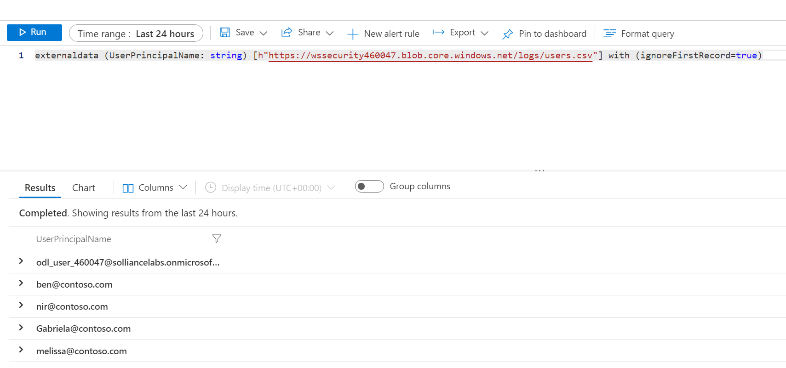

6. Run the following query to do a filter based on the `externaldata` method:

    ```kql
    let timeRange = 1d;
    let allowlist = externaldata (UserPrincipalName: string) [h"https://wssecuritySUFFIX.blob.core.windows.net/logs/users.csv"] with (ignoreFirstRecord=true);
    SigninLogs
    | where TimeGenerated >= ago(timeRange)
    // Exclude non-failure types
    | where ResultType !in ("0", "50125", "50140")
    // Exclude allow-listed users
    | where UserPrincipalName !in~ (allowlist)
    ```

    > **NOTE** You may not get any results back from the `SigninLogs` table.

### Task 2: Create Custom Table

1. Switch to the **wssecuritySUFFIX-paw-1** virtual machine
2. Open the `c:/labfiles/sentinel-defender-workshop-400/artifacts/day-02/CreateExternalTable.ps1` script in a Windows Powershell ISE window
3. Press **F5** to run the script
4. Switch to your Log Analytics workspace, run the following KQL query

    ```KQL
    users_lookup_CL
    ```

    > **Note** It can take up to 15 minutes for your custom table to be displayed.

### Task 3: Create query function

1. Switch to your Log Analytics workspace
2. Select **Logs**
3. Review the following KQL query then run it.  Note how `datatable` is used to create a query time lookup:

    ```KQL
    let Lookup = datatable (UserName:string,DisplayName:string,Risk: int,Location:dynamic)
    [
    'chris@contoso.com','Chris Green',70,'{ "City": "Redmond", "State": "Washintgon", "Country": "US" }',
    'ben@contoso.com','Ben Andrews',100,'{"City": "Oxford", "State": "Oxfordshare", "Country": "UK" }',
    'nir@contoso.com','Nir Cohen',50,'{ "City": "Tel-Aviv", "State": "", "Country": "IL" }',
    'Gabriela@contoso.com','Cynthia Silva',20,'{ "City": "Rio de Janeiro", "State": "Rio de Janeiro", "Country": "BR" }',
    'melissa@contoso.com','Chandana  Agarwals' ,100,'{ "City": "Mumbai", "State": "Maharashtra", "Country": "IN" }'
    ];
    Lookup
    ```

4. In the top navigation, select **Save->Save as function**

    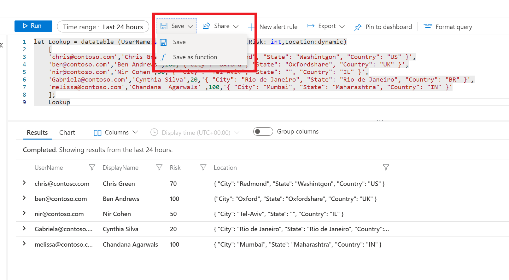

5. For the name, type **users_lookup**
6. For the legacy category, type **Functions**

    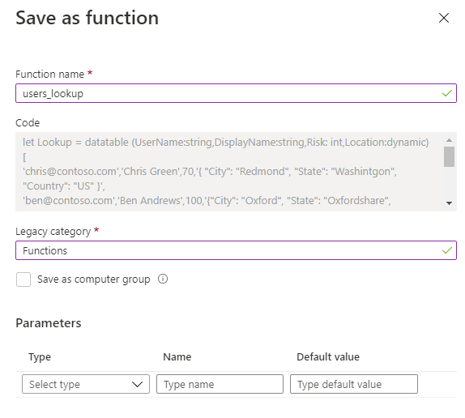

7. Select **Save**
8. Run the following queries to see how to use this new function:

    ```KQL
    users_lookup | project UserName
    ```

    ```kql
    users_lookup | where Risk > 90
    ```

### Task 4: Create Sentinel Watchlist

1. Browse to Azure Sentinel
2. Select your lab workspace
3. Under **Configuration**, select **Watchlist**
4. Select **+ Add new**

    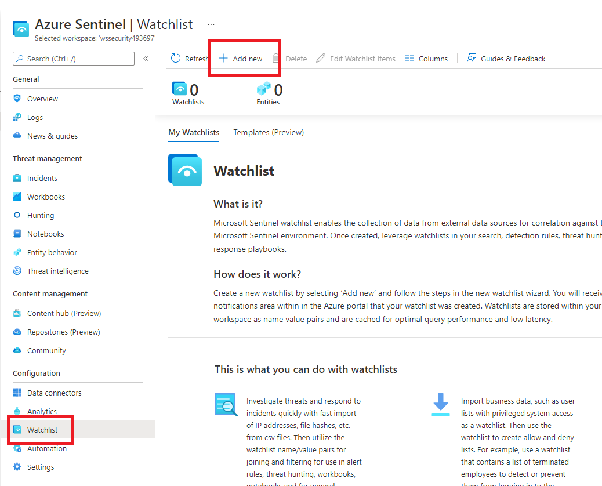

5. For the name, type **Users**
6. For the alias, type **Users**
7. Select **Next: Source>**
8. Select **Browse for files**, browse to the `C:\labfiles\sentinel-defender-workshop-400\artifacts\day-02\users.csv` file
9. For the search key field, select **UserName**

    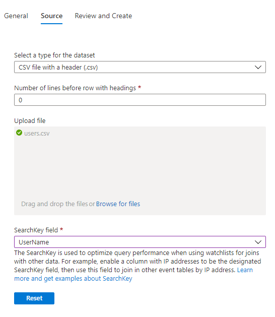

10. Select **Next: Review and create**
11. Select **Create**, you should see a new watchlist displayed:

    

12. Select the new watchlist
13. Select **View in Log Analytics**, you should see the `_GetWatchlist` function is being called:

    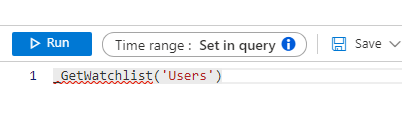

## Exercise 4: Mapping Log Data

### Task 1: Mapping queries

1. Open the Azure Portal
2. Browse to the **wssecuritySUFFIX** workspace
3. Select **Logs**
4. Run the following query:

    ```kql
    union isfuzzy=true 
    (W3CIISLog | extend TrafficDirection = "InboundOrUnknown", Country=RemoteIPCountry, Latitude=RemoteIPLatitude, Longitude=RemoteIPLongitude), 
    (DnsEvents | extend TrafficDirection = "InboundOrUnknown", Country= RemoteIPCountry, Latitude = RemoteIPLatitude, Longitude = RemoteIPLongitude), 
    (WireData | extend TrafficDirection = iff(Direction != "Outbound","InboundOrUnknown", "Outbound"), Country=RemoteIPCountry, Latitude=RemoteIPLatitude, Longitude=RemoteIPLongitude), 
    (WindowsFirewall | extend TrafficDirection = iff(CommunicationDirection != "SEND","InboundOrUnknown", "Outbound"), Country=MaliciousIPCountry, Latitude=MaliciousIPLatitude, Longitude=MaliciousIPLongitude), 
    (CommonSecurityLog | extend TrafficDirection = iff(CommunicationDirection != "Outbound","InboundOrUnknown", "Outbound"), Country=MaliciousIPCountry, Latitude=MaliciousIPLatitude, Longitude=MaliciousIPLongitude, Confidence=ThreatDescription, Description=ThreatDescription), 
    (VMConnection | where Type == "VMConnection" | extend TrafficDirection = iff(Direction != "outbound","InboundOrUnknown", "Outbound"), Country=RemoteCountry, Latitude=RemoteLatitude, Longitude=RemoteLongitude) 
    ```

5. Review the results, notice how the query combines data from several different tables
6. Modify the query to the following, review the changes:

    ```kql
    let daystoSearch = 30d; 
    let myLongitude= -0.925915; 
    let myLatitude = 51.461377; 
    union isfuzzy=true 
    (W3CIISLog | extend TrafficDirection = "InboundOrUnknown", Country=RemoteIPCountry, Latitude=RemoteIPLatitude, Longitude=RemoteIPLongitude), 
    (DnsEvents | extend TrafficDirection = "InboundOrUnknown", Country= RemoteIPCountry, Latitude = RemoteIPLatitude, Longitude = RemoteIPLongitude), 
    (WireData | extend TrafficDirection = iff(Direction != "Outbound","InboundOrUnknown", "Outbound"), Country=RemoteIPCountry, Latitude=RemoteIPLatitude, Longitude=RemoteIPLongitude), 
    (WindowsFirewall | extend TrafficDirection = iff(CommunicationDirection != "SEND","InboundOrUnknown", "Outbound"), Country=MaliciousIPCountry, Latitude=MaliciousIPLatitude, Longitude=MaliciousIPLongitude), 
    (CommonSecurityLog | extend TrafficDirection = iff(CommunicationDirection != "Outbound","InboundOrUnknown", "Outbound"), Country=MaliciousIPCountry, Latitude=MaliciousIPLatitude, Longitude=MaliciousIPLongitude, Confidence=ThreatDescription, Description=ThreatDescription), 
    (VMConnection | where Type == "VMConnection" | extend TrafficDirection = iff(Direction != "outbound","InboundOrUnknown", "Outbound"), Country=RemoteCountry, Latitude=RemoteLatitude, Longitude=RemoteLongitude) 
    | where TimeGenerated > startofday(ago(daystoSearch)) and TimeGenerated < startofday(now()) 
    | where isnotempty(Country) and isnotempty(Latitude) and isnotempty(Longitude) 
    | extend distance_in_kilometers = geo_distance_2points(Longitude, Latitude, myLongitude, myLatitude)/1000.00 
    | extend distance_in_miles = geo_distance_2points(Longitude, Latitude, myLongitude, myLatitude)/1609.344 
    | summarize count() by bin(TimeGenerated,1d), Country, DistanceKMandMiles = strcat(round(distance_in_kilometers,1)," / ",round(distance_in_miles,1) ), Type, TrafficDirection, IndicatorThreatType, DeviceVendor 
    | sort by TimeGenerated asc 
    ```

7. Open Azure Monitor by searching for **Monitor** in Azure global search
8. Select **Workbooks**
9. Select **Workspace Usage**

    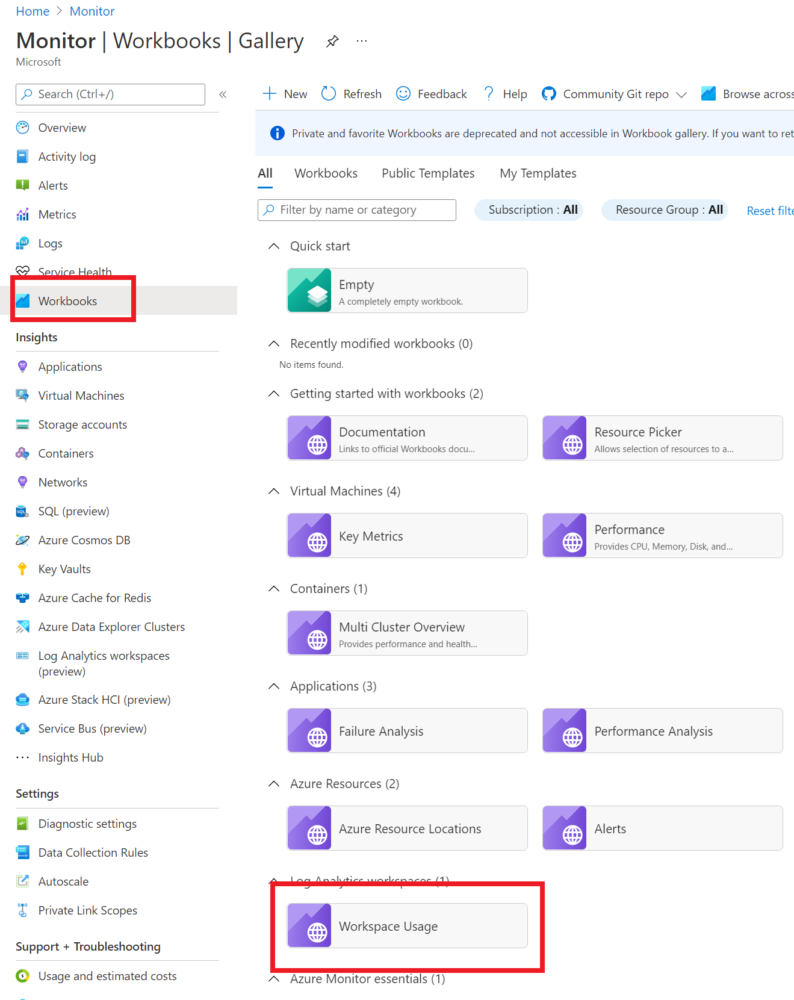

10. Select **Edit**
11. At the bottom of the page, select **Add->Add query**

    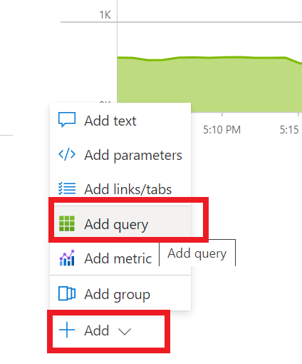

12. Copy the following query into the `Log Analytics workspace Logs Query` textbox
13. Review the query, notice the replacement of the query items with workbook variables:

    ```kql
    let myLongitude= -0.925915; 
    let myLatitude = 51.461377; 
    union isfuzzy=true 
    (W3CIISLog | extend TrafficDirection = "InboundOrUnknown", Country=RemoteIPCountry, Latitude=RemoteIPLatitude, Longitude=RemoteIPLongitude), 
    (DnsEvents | extend TrafficDirection = "InboundOrUnknown", Country= RemoteIPCountry, Latitude = RemoteIPLatitude, Longitude = RemoteIPLongitude), 
    (WireData | extend TrafficDirection = iff(Direction != "Outbound","InboundOrUnknown", "Outbound"), Country=RemoteIPCountry, Latitude=RemoteIPLatitude, Longitude=RemoteIPLongitude), 
    (WindowsFirewall | extend TrafficDirection = iff(CommunicationDirection != "SEND","InboundOrUnknown", "Outbound"), Country=MaliciousIPCountry, Latitude=MaliciousIPLatitude, Longitude=MaliciousIPLongitude), 
    (CommonSecurityLog | extend TrafficDirection = iff(CommunicationDirection != "Outbound","InboundOrUnknown", "Outbound"), Country=MaliciousIPCountry, Latitude=MaliciousIPLatitude, Longitude=MaliciousIPLongitude, Confidence=ThreatDescription, Description=ThreatDescription), 
    (VMConnection | where Type == "VMConnection" | extend TrafficDirection = iff(Direction != "outbound","InboundOrUnknown", "Outbound"), Country=RemoteCountry, Latitude=RemoteLatitude, Longitude=RemoteLongitude) 
    | where TimeGenerated {TimeRange:query}
    | where isnotempty(Country) and isnotempty(Latitude) and isnotempty(Longitude) 
    | extend distance_in_kilometers = geo_distance_2points(Longitude, Latitude, myLongitude, myLatitude)/1000.00 
    | extend distance_in_miles = geo_distance_2points(Longitude, Latitude, myLongitude, myLatitude)/1609.344 
    | summarize count() by bin(TimeGenerated,1d), Country, DistanceKMandMiles = strcat(round(distance_in_kilometers,1)," / ",round(distance_in_miles,1) ), Type, TrafficDirection, IndicatorThreatType, DeviceVendor, Longitude, Latitude
    | sort by TimeGenerated asc 
    ```

    > **NOTE** The MaliciousIP is added on ingestion when you have Threat Indicators created.  If you do not have any IoCs, you will not see any data here.

14. For the **Log Analytics workspace** dropdown, select **Load all subscriptions**

    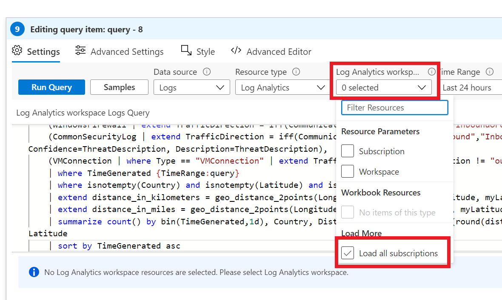

15. After selecting to load the subscriptions, select the **wssecuritySUFFIX** workspace
16. In the Visualization dropdown, select **Map**

    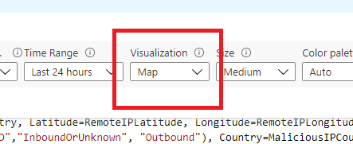

17. Select **Run Query**
18. In the Map settings, set the latitude to **RemoteIPLatitude**
19. In the Map settings, set the longitude to **RemoteIPLongitude**
20. Select **Apply**, then select **Save & Close**
21. Select **Save As**
22. For the title, type **Malicious IP Map**
23. For the resource group, select the lab resource group

    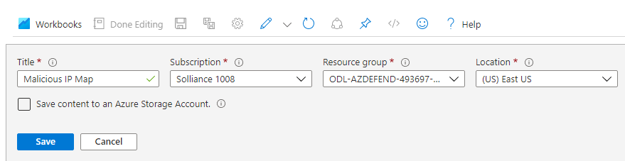

24. Select **Save**
25. Select **Done Editing**, you should now see your logs mapped onto a world map.

    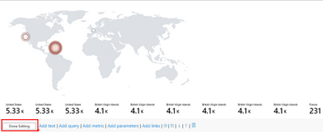

## Exercise 5 : Azure Sentinel Incidents and Investigation

### Task 1: Setup Query Rule

1. In the Azure Sentinel blade, under **Configuration**, select **Analytics**
2. Select **+Create**, then select **Schedule query rule**

   

3. For the name, type **Custom threats**
4. For the tactics, select **Discovery**
5. For the severity, select **High**
6. Select **Next: Set rule logic**

    

7. For the rule query, type the following:

    ```output
    OrgSecurity_CL
    | where IsThreat_b == true
    | extend IPCustomEntity = IPAddress
    | extend HostCustomEntity = Computer
    ```

    > **Note** You would need to have imported data into the custom table log called **OrgSecurity** for this table to exist.

8. Select **Next: Incident Settings**
9. Ensure the **Create incidents from alerts trigger by this analytics rule** is toggled to **Enabled**
10. Ensure the **Group related alerts, trigger by this analytics rule, into incidents** is toggled to **Enabled**
11. Ensure the **Group related alerts, triggered by this analytics rule in incidents**
12. For the time frame, select **5 Hours**
13. For the grouping, select **Grouping alerts into a single incident if the selected entities match**
14. Select the **IP** entity

    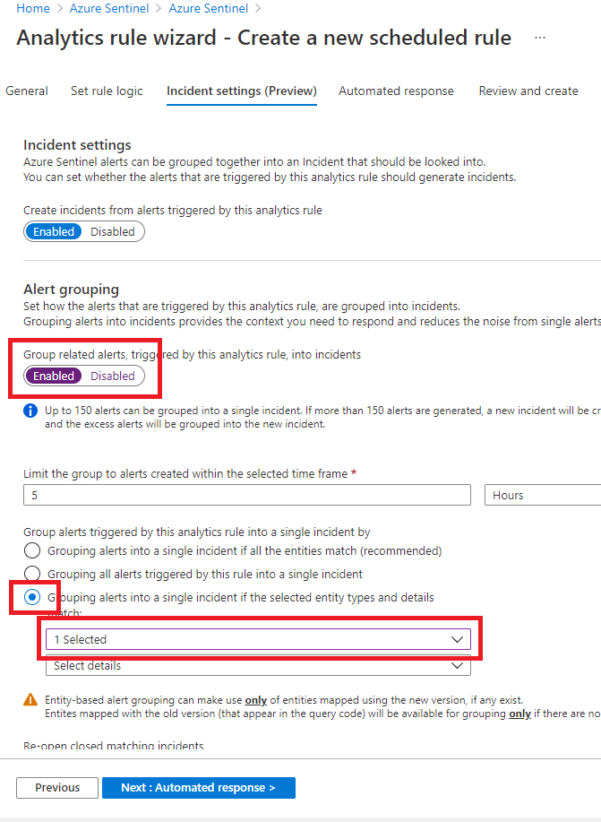

15. Select **Next: Automated response**
16. Select **Next: Review**
17. Select **Create**

### Task 2: Investigate Incident

1. In the **Azure Sentinel** blade, select **Incidents**.
2. You should see a new incident displayed based on your previously created Alert:

    

3. Select the incident, you will notice Sentinel is doing some prep work.

    

4. Eventually the incident will be ready to be investigated, in the meantime we will continue with some other lab work.

## Exercise 5 : Extending Azure Sentinel Incidents (Optional)

This task requires registration with RiskIQ to gain access to an API Key. It can take a few days to do this action, but if you wish to perform these steps, you can get through most of them without the account/key.

### Task 1 : RiskIQ Api Key

1. Open a browser window to https://api.riskiq.net
2. In the left navigation, select the **Register Now** link, or login to your account
3. Fill out the form, login using the email you used in the form
4. Register and validate your email address in the verification email
5. [Login to the site](https://community.riskiq.com/login), select the profile icon, then select **Account Settings**

    

6. Select **Show** for the User, record your API Key and Secret

### Task 2 : Extend Azure Sentinel

1. Switch to the Azure Portal, browse to your resource group
2. Select **Create**
3. Search for **Template deployment**, then select it
4. Select **Create**
5. Select **Build your own template in the editor**
6. Copy the **c:/labfiles/{workshopname}/artifacts/day-02/riskiq-runbook.json** into the template window.
7. Select **Save**
8. For the playbook name, ensure **Recent-Host-Passive-DNS** is displayed
9. For your username, type the lab username (ex: odl_user_SUFFIX@DOMAIN.onmicrosoft.com):

    

10. Select **Review and create**
11. Select **Create**
12. In the Azure portal, navigate to your Azure Sentinel workspace
13. Under **Configuration**, select **Automation** from the Azure Sentinel navigation menu
14. Select the **Active playbooks** tab
15. Select the **Recent-Host-Passive-DNS** playbook by selecting the playbook name

    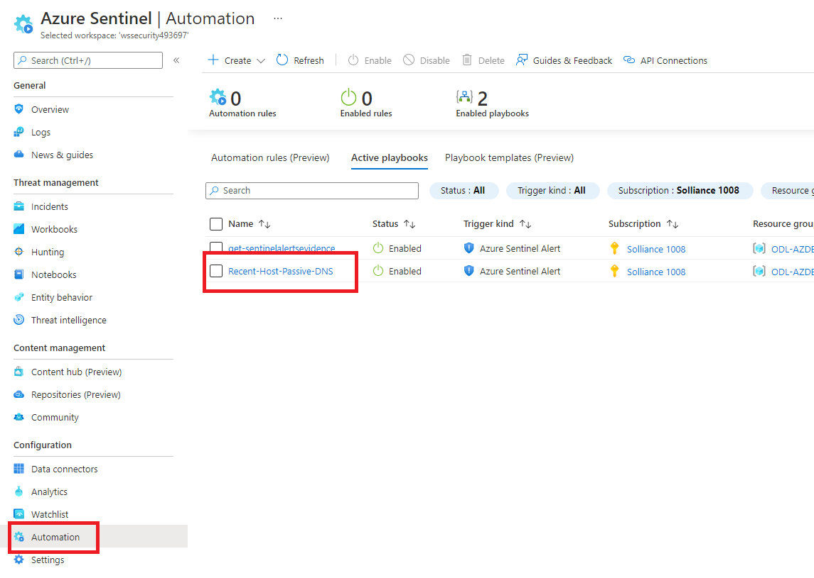

16. Under **Development Tools**, select **API Connections**
17. Select the **azuresentinel-Recent-Host-Passive-DNS** connection

    

18. Under **General**, select **Edit API Connection**
19. Select **Authorize**
20. Login using your lab credentials
21. Select **Save**
22. Select the **riskiqintelligence-Recent-Host-Passive-DNS** connection
23. Under **General**, select **Edit API Connection**
24. Enter your RiskIQ API token and secret obtained from RiskIQ portal

    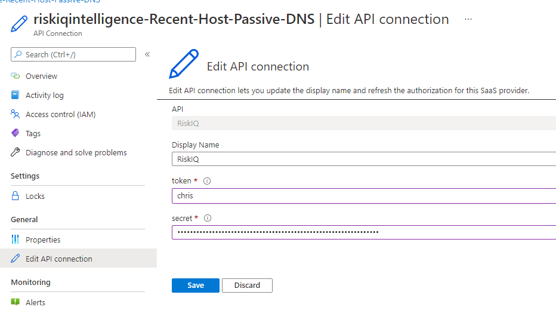

25. Select **Save**
26. Navigate to your Azure Sentinel **Analytics** page
27. Select the **Custom Threats** rule you created earlier, then select **Edit**

    > **NOTE** The Recent-IP-Passive-DNS playbook works with analytics rules which map IP address entities so make sure you are working with such a rule. For simple testing of the playbook automation you can use rule logic as shown below to force an alert creation with a specific IP address.

    ```output
    AzureActivity
    | take 1
    | extend IPCustomEntity = "144.91.119.160"
    ```

28. Navigate to the **Automated response** tab
29. Place a check mark in the box for the Recent-Host-Passive-DNS playbook which will enable the playbook to run each time the analytic rule generates security alerts
30. Select **Next: Review**
31. Select **Save** to finish and return to the Analytics page

### Task 3 : Review Incident

1. Navigate back to your Azure Sentinel Incidents page
2. Locate the new incident generated from the analytic rule previously and select it
3. Select **View full details** from the information pane
4. Select the **View playbooks** on the far right
5. For the **Recent-Host-Passive-DNS** playbook, select **Run**.  After a few moments you will see a new comment added.
6. Select the **Comments** tab to see the enrichment added by the Recent-Host-Passive-DNS playbook automation. You can also view the information in the RiskIQ portal by following the link provided at the bottom of the comment.

    

> **Congrats, you have used Machine Learning to analyze signals from your Azure resources and tied that data to Azure Sentinel with extended external API calls for incident enrichment. Good luck on your security journey in Azure!**

## Reference Links

- [Azure Monitor](https://docs.microsoft.com/en-us/azure/azure-monitor/overview)
- [Logs in Azure Monitor](https://docs.microsoft.com/en-us/azure/azure-monitor/platform/data-platform-logs)
- [Log Analytics Workspace](https://docs.microsoft.com/en-us/azure/azure-monitor/platform/design-logs-deployment)
- [Log Analytics agent overview](https://docs.microsoft.com/en-us/azure/azure-monitor/platform/log-analytics-agent)
- [Custom logs in Azure Monitor](https://docs.microsoft.com/en-us/azure/azure-monitor/platform/data-sources-custom-logs)
- [Send log data to Azure Monitor with the HTTP Data Collector API (public preview)](https://docs.microsoft.com/en-us/azure/azure-monitor/platform/data-collector-api)
- [Create custom fields in a Log Analytics workspace in Azure Monitor (Preview)](https://docs.microsoft.com/en-us/azure/azure-monitor/platform/custom-fields)
- [Parse text data in Azure Monitor logs](https://docs.microsoft.com/en-us/azure/azure-monitor/log-query/parse-text)
- [Sysmon](https://docs.microsoft.com/en-us/sysinternals/downloads/sysmon)
